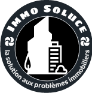

# Immobilier

l'immobilier en côte d'ivoire

## problematique 

L'immobilier comprend la construction, la location et la vente de maisons ou de terrains.
Un proche parent est grugé, spolié de son bien ou surfacturé lors de la construction de sa maison.

**Quelle solution proposez-vous pour éviter cela dans l'avenir ?**

Exemple : une plateforme de gestion foncière gérée par le ministère, un site répertoriant les ouvriers et les prix de leur travail, un site comparant les prix des matériaux, etc."

## Notre solution et Objectifs

**Solution** : 

Nous avons décider de mettre en place une Plateform du nom de **IMMO SOLUCE** spécialisée dans :
* la mise en relation entre vendeurs et acquéreurs (locataires/acheteurs) de biens immobiliers
* une fiabilités assurées grace à notre système de vérification
* Lien du site : [ici](https://immo-soluce.web.app/)

**Nos objectifs** :

* révolutionner le secteur de l’immobilier ivoirien par une mise en relation directe entre les vendeurs et les acheteurs via notre plateforme.

* limiter les coûts de transactions par la réduction du nombre d’intervenants dans le processus de vente et ainsi de faciliter l'accès au logement aux populations

## Images

